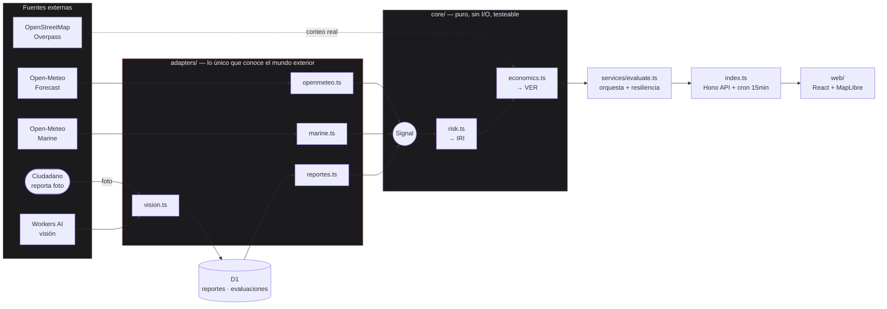

<div align="center">

# 🌊 MAREA

### Sistema de Alerta Temprana de inundación para el corredor turístico de Cartagena
**con capa de valor económico expuesto en tiempo real**

CTW Hackathon · Cartagena Edition · misión **"Cartagena Construye con IA"** · UNITECNAR

[](https://github.com/HCHAPS404/BIT-HILLLS/actions/workflows/deploy.yml)
[](LICENSE)


**[🌐 Ver la app en vivo](https://marea-drq.pages.dev)** · **[⚙️ API en vivo](https://marea-api.marea-cartagena.workers.dev)** · **[📊 Slides del pitch](PITCH-SLIDES.md)**

</div>

---

## Tabla de contenidos

- [Qué hace](#qué-hace)
- [Honestidad del modelo](#honestidad-del-modelo--decirlo-antes-de-que-lo-pregunten)
- [El motor económico (VER)](#el-motor-económico-ver)
- [Arquitectura](#arquitectura)
- [API](#api)
- [Fuentes de datos](#fuentes-de-datos-todas-gratis-sin-api-key)
- [Diseño](#diseño-instrumento-náutico-no-dashboard)
- [Arrancar en 2 minutos](#arrancar-en-2-minutos)
- [Deploy](#deploy)
- [Estado del proyecto](#estado-del-proyecto)
- [Los tres números del pitch](#los-tres-números-del-pitch)

---

## Qué hace

Predice, con 24–72 h de anticipación y **sin un solo sensor instalado**, qué zonas de Cartagena van a quedar bajo agua — y cuánto dinero cuesta cada hora que estén así.

### La tesis técnica

En el corredor Bocagrande–Centro–Manga el agua drena **por gravedad** hacia la bahía. Cuando el mar sube, la boca de descarga pierde altura útil y el sistema se represa.

```
IRI = 100 · S_zona · R^0.7 · (0.55 + 0.20·D + 0.25·O)
```

| Término | Significa | Fuente |
|---|---|---|
| `R` | **lluvia** — dispara | `min(1, P3h / 45mm)` · Open-Meteo |
| `D` | **drenaje bloqueado por el mar** — modula | nivel del mar + 0,6·oleaje · Open-Meteo Marine |
| `O` | **obstrucción del canal** — amplifica | reportes ciudadanos + visión por IA |
| `S` | **susceptibilidad de zona** — pondera | cota, historial, proximidad a caño |

`R` es multiplicativo: **sin lluvia, IRI = 0**. Esa es la verdad física.
El paréntesis va de 0,55 a 1,00 → marea alta + canal tapado **casi duplican** el riesgo con la misma lluvia.

### Verificado en el motor, no estimado

| Escenario | R | D | O | IRI Bocagrande | VER |
|---|---|---|---|---|---|
| Aguacero + **pleamar** | 0,93 | 1,00 | 0,70 | **83,7 · 🔴 rojo** | $337.301.751 |
| **El mismo** aguacero + **bajamar** | 0,93 | 0,00 | 0,70 | **65,6 · 🟠 naranja** | $188.829.108 |
| Mar de leva (tipo feb-2026) | 0,27 | 1,00 | 0,50 | 33,0 · 🟡 amarillo | $0 |
| Día seco (control de la compuerta) | 0,00 | 1,00 | 0,70 | **0,0 · 🟢 verde** | $0 |

> **18,1 puntos de IRI y $148 millones COP de diferencia, con la misma lluvia y el mismo canal.** Solo cambió la marea. Eso es el pitch — y está verificado en producción, no en una diapositiva.

---

## Honestidad del modelo — decirlo antes de que lo pregunten

- **El IRI no está calibrado.** No existe una serie etiquetada de inundaciones por zona/hora accesible como dataset abierto (lo verificamos, no lo asumimos — ver [Estado del proyecto](#estado-del-proyecto)). Es un **índice de plausibilidad ordenada**, no una probabilidad. La UI lo declara con el badge `SIN CALIBRAR · v0.1`.
- **Plan de calibración, ya construido y esperando datos reales:** [`scripts/calibrar_iri.py`](scripts/calibrar_iri.py) ajusta una regresión logística sobre los mismos cuatro términos (R, D, O, S) contra reportes de la OAGRD (304 emergencias en 2024, 49 por lluvias) cruzados con reanálisis ERA5. El script corre hoy — falta el dataset, que requiere un derecho de petición formal (documentado en el propio script).
- **El rango mareal de Cartagena es de 33 cm** (medido: 0,06 → 0,39 m el 13-ago-2026). La pleamar sola no inunda nada. Por eso `D` pesa 0,20 y no 0,50, y el oleaje entra con factor 0,6: el evento que importa es el **mar de leva**, no la pleamar de un martes.
- **Riesgo real del modelo:** si Bocagrande se inunda por capacidad insuficiente del alcantarillado pluvial y no por represamiento, `D` está sobrevalorado. No lo podemos refutar sin datos de la red pluvial. Es la primera pregunta del plan de calibración.
- **Todo lo simulado viaja marcado** `simulado: true` y la UI lo pinta con banda diagonal. Nunca se disfraza de dato real.

---

## El motor económico (VER)

```
VER = P(evento) · (H_interrup + 2h) · F_temporada · factor_precio_zona
      · Σ_cat [ N_cat · ticket_cat · tx_hora_cat · η_cat ]
```

- **`N_cat` es un conteo REAL de OpenStreetMap**: 2.559 elementos consultados vía Overpass, **1.533 dentro de las seis zonas**. OSM **subcuenta** → el VER es un **piso**, no un censo. Conservador por construcción.
- **`η` = fracción de ingreso perdido, NO diferido.** Hotel 0,15 (la noche ya está pagada, se pierde F&B); restaurante 0,85 (el almuerzo no se recupera mañana). Este parámetro es el que demuestra que entendimos el negocio y no solo la meteorología.
- **`factor_precio` corrige el nivel de precios por zona.** Sin él, aplicar el ticket de Bocagrande a una tienda de El Socorro infla el VER un orden de magnitud.
- **Ningún número está escondido:** `GET /api/params` los expone todos con su fuente, y el panel lateral los deja cambiar en vivo. **Nunca discutas una cifra con un jurado — dale el control deslizante.**

---

## Arquitectura

**La decisión que hay que defender:** el core consume `Signal`, no APIs. Ningún archivo de `core/` importa `fetch` ni sabe que Open-Meteo existe. Los adaptadores viven en `adapters/` y son ~40 líneas.

Consecuencia: **cambiar de fuente de datos —o de dominio entero— son 40 líneas y una tabla de pesos.** Cuando el jurado pregunte "¿y si cambio los datos?", la respuesta ya está construida.



```
api/src/
  core/       types · params · risk · economics · zonas   ← puro, sin I/O, testeable
  adapters/   openmeteo · marine · vision · reportes · escenarios  ← lo único que conoce el mundo
  services/   evaluate · notify                            ← orquesta + resiliencia + Fontumi
  index.ts    rutas Hono + cron cada 15 min
web/src/
  components/ RelojMarea ★ · PanelSupuestos ★ · ContadorVER ★ · MapaRiesgo · GlifoBanda
  styles/     tokens.css                                  ← el sistema de diseño
```

### Resiliencia (probada bajo fallo real)

Si una fuente externa cae, el sistema **no muestra pantalla en blanco**: cae a escenario semilla y lo declara (`degradado: true` + avisos visibles en la UI). Ya ocurrió durante el desarrollo y funcionó.

### El ciclo ciudadano, cerrado de verdad

`POST /api/reportes` no es un buzón que nadie lee: el reporte se agrega en `adapters/reportes.ts` (decaimiento exponencial, vida media 10 días) y **sobrescribe la señal de obstrucción real** en la siguiente evaluación — verificado en producción moviendo el componente `O` de una zona de 0,4 a 1,0 con un solo reporte. Con foto (`foto_base64`) y binding de Workers AI, la severidad la pone un clasificador de visión en vez de un número puesto a mano.

---

## API

| Método | Ruta | |
|---|---|---|
| `GET` | `/api/zonas` | GeoJSON con IRI y VER — una llamada pinta el mapa |
| `GET` | `/api/riesgo/:zona` | serie horaria, ventana crítica, desglose, sensibilidad |
| `GET` | `/api/params` | todos los supuestos con su fuente |
| `GET` | `/api/escenarios` | los 4 escenarios semilla |
| `POST` | `/api/simular` | recalcula con overrides. **Puro: no escribe nada** |
| `POST` | `/api/reportes` | reporte ciudadano de canal (foto → visión, o severidad manual) |
| `POST` | `/api/suscriptores` | alta de negocio para alertas WhatsApp/voz |
| `GET` | `/api/salud` | estado de cada fuente externa |

---

## Fuentes de datos (todas gratis, sin API key)

| Fuente | Uso | Estado |
|---|---|---|
| Open-Meteo Forecast | precipitación h+72 | ✅ ~900 ms |
| Open-Meteo Marine | nivel del mar + oleaje | ✅ ~850 ms |
| Overpass / OpenStreetMap | conteo de establecimientos | ✅ 2.559 elementos |
| Carto dark-matter | mapa base | ✅ sin token |
| Cloudflare Workers AI | clasificación de severidad de canal | ✅ `@cf/llava-hf/llava-1.5-7b-hf` |

---

## Diseño: instrumento náutico, no dashboard

Van a existir seis dashboards con tarjetas redondeadas grises sobre `slate-50` y shadcn por defecto, todos del mismo prompt. La diferenciación es la única forma de que el jurado recuerde cuál era el nuestro.

**Reglas que no se rompen:** `border-radius` máximo 2 px · cero sombras · jerarquía por líneas de 1 px · todo número en monoespaciada `tabular-nums` (los dígitos no bailan) · retícula de papel milimetrado · el badge `SIN CALIBRAR` visible, no escondido.

| Componente | Qué hace |
|---|---|
| **★ Reloj de Marea** | SVG propio. Grafica **los dos términos de la propia fórmula**: radio = `D` (bloqueo de drenaje), color = `R` (lluvia), sector rojo = donde ambos coinciden. Al pasar de pleamar a bajamar, el anillo se desinfla en vivo. |
| **★ Panel de Supuestos** | Cada parámetro es un deslizador con su fuente. Se mueve y el mapa se re-tarifa. Convierte cada objeción del jurado en una demostración. |
| **★ Contador de VER** | Cifra que cuenta hacia arriba, siempre con la letra pequeña honesta: *valor esperado, supuestos editables*. |
| **★ Glifo de Banda** | La severidad no depende solo del color — cada banda tiene su propia trama (punteado/rayado/denso/cruzado), accesible para lectores de pantalla. |
| **★ ES/EN** | Es un producto para zona turística. |

---

## Arrancar en 2 minutos

```bash
cd api && npm install && npm run dev   # :8787
```

```bash
cd web && npm install && npm run dev   # :5173
```

**No hace falta crear base de datos ni ninguna cuenta.** D1 es opcional: la API calcula en vivo.

---

## Deploy

**Manual:**
```bash
cd api && npm run deploy   # Cloudflare Worker
cd web && npm run deploy   # Cloudflare Pages (build + wrangler pages deploy)
```

**Automático (CI/CD):** [`.github/workflows/deploy.yml`](.github/workflows/deploy.yml) despliega ambos en cada push a `main`
(o manualmente desde la pestaña Actions → Deploy → Run workflow).

Configurar una vez en el repo de GitHub (Settings → Secrets and variables → Actions):

| Tipo | Nombre | Valor |
|---|---|---|
| Secret | `CLOUDFLARE_API_TOKEN` | token con permisos Workers Scripts:Edit + Cloudflare Pages:Edit |
| Variable | `CLOUDFLARE_ACCOUNT_ID` | Cloudflare dashboard → barra lateral derecha |
| Variable | `VITE_API` | URL pública del Worker |

Secretos del Worker en runtime (no van en el workflow, se ponen una sola vez):
```bash
cd api && npx wrangler secret put FONTUMI_TOKEN   # opcional — ver Estado del proyecto
```

---

## Estado del proyecto

Todas las ramas de feature están integradas a `main` y desplegadas en producción. Detalle operativo completo (para retomar el proyecto con cualquier herramienta, no solo esta) en [`AGENTS.md`](AGENTS.md).

| Área | Estado |
|---|---|
| API + motor de riesgo + económico | ✅ en vivo |
| Web (mapa, reloj de marea, panel de supuestos) | ✅ en vivo |
| CI/CD (GitHub Actions → Cloudflare) | ✅ funcionando |
| D1 (historial, reportes) | ✅ activo |
| Reportes ciudadanos → motor de riesgo | ✅ conectado y verificado en producción |
| Clasificador de visión (foto → severidad) | ✅ conectado y verificado en producción |
| Notificaciones Fontumi (WhatsApp/voz) | ⏸️ **en standby** — interfaz construida y probada contra la API real (crear contacto + enviar mensaje, ambos aceptados); falta que la cuenta active el canal de WhatsApp Business del lado de Fontumi. No es un bloqueo de código. |
| Historial de fotos en R2 | ⏸️ código listo, falta activar R2 en el dashboard de Cloudflare (un paso, sin bypass por API) |
| Calibración del IRI | ⏸️ script listo ([`scripts/calibrar_iri.py`](scripts/calibrar_iri.py)), falta el dataset real (no existe como open data — requiere derecho de petición a la OAGRD) |

---

## Los tres números del pitch

- **49 emergencias por lluvias e inundaciones en 2024** — 16 % de 304 (OAGRD vía Cartagena Cómo Vamos)
- **43 % de cartageneros insatisfechos con las basuras en calle** — esa basura tapa los canales (EPC 2024)
- **1.533 establecimientos** contados sobre OpenStreetMap en las seis zonas. No es estimación: es conteo.

> En 2024 se limpiaron 50 canales. El problema nunca fue limpiar — fue **saber cuál primero**.
